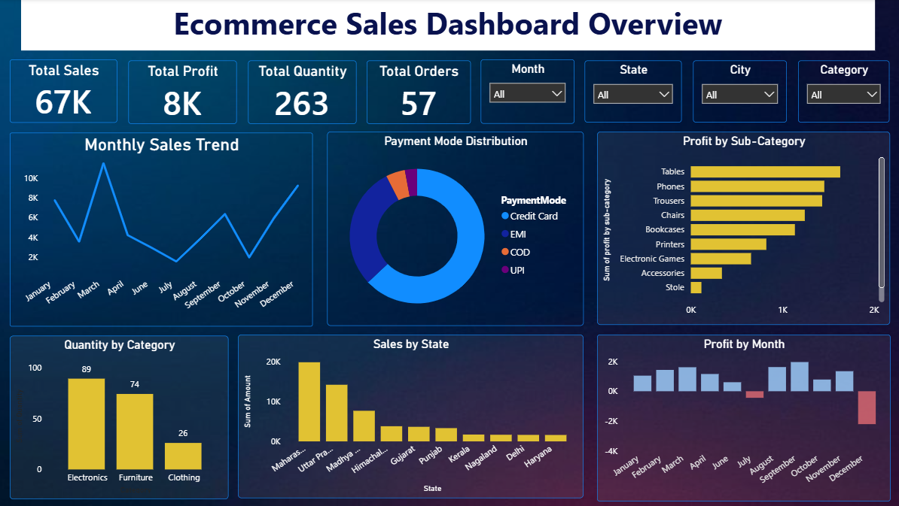

# Ecommerce Sales Dashboard

## Project Overview
This project analyzes ecommerce sales performance using Power BI.

## Tools Used
- Power BI
- Excel

## KPIs
- Total Sales: 67K
- Total Profit: 8K
- Total Quantity: 263
- Total Orders: 57

## Dashboard Features
- Monthly Sales Trend
- Payment Mode Distribution
- Profit by Sub-Category
- Quantity by Category
- Sales by State
- Profit by Month
  
## Data Cleaning
- Removed duplicate records
- Handled missing values
- Corrected data types using Power Query

## Key Insights
- Maharashtra generated the highest sales.
- Electronics category had the highest quantity sold.
- Credit Card was the most preferred payment method.
- Some months showed negative profit, indicating seasonal performance variations.  

## Dashboard Preview

